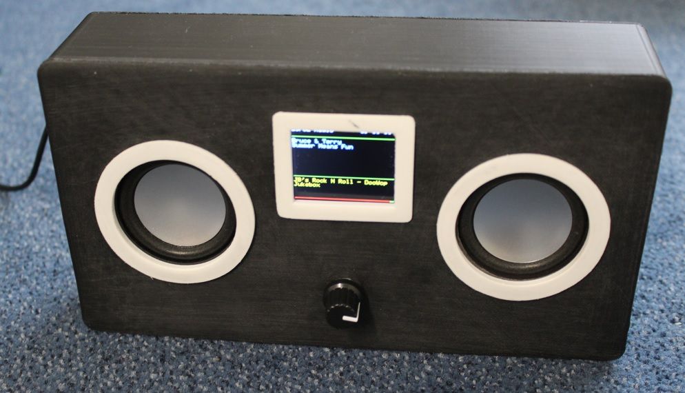

# ESP32-Radio

Internet radio based on ESP32, VS1053 and a TFT screen.  Will compile in Arduino IDE.
See the review by Andreas Spiess at https://www.youtube.com/watch?v=hz65vfvbXMs.

Look for documentation and printdesign in the doc directory.

Features:
-	Can connect to thousands of Internet radio stations that broadcast MP3 or Ogg audio streams.
- Can connect to a standalone mp3 file on a server.
- Support for .m3u playlists.
- Can play mp3 tracks from SD card or USB stick (CH376).
-	Uses a minimal number of components; no Arduino required.
-	Handles bitrates up to 320 kbps.
-	Has a preset list of maximal 100 favorite radio stations in configuration file.
- Configuration (preferences) can be edited through web interface.
-	Can be controlled by a tablet or other device through a build-in webserver.
- Can be controlled over MQTT.
- Can be controlled over Serial Input.
- Can be controlled by IR.
-	Can be controlled by rotary switch encoder.
- Can be controlled by touch pins.
-	Up to 14 free input pins can be configured to control the radio.
-	The strongest available WiFi network is automatically selected.
-	Heavily commented source code, easy to add extra functionality.
-	Debug information through serial output.
-	Uses a 12 kB queue to provide smooth playback.
-	Software update over WiFi possible (OTA) through Arduino IDE or remote host.
-	Bass and treble control.
-	Saves volume, bass, treble and preset station over restart.
- Configuration also possible if no WiFi connection can be established.
- Can play iHeartRadio stations.
- Displays time of day on TFT.
- Optional display remaining battery capacity on screen.
- PCB available (see doc).
- 3D case available (see doc).

See documentation in doc/pdf-file.

Last changes:
- 28-jun-2021, Allow special characters in station name.
- 21-jun-2021, Display station name from preference if not in metadata.
- 29-apr-2021, Fixed SSD1309 bug.
- 25-apr-2021, Fixed SSD1309 bug, thanks to Juraj Liso.
- 19-feb-2021, More Oled models.
- 16-feb-2021, Give BBC stations some time to react. See issue 437.
- 15-feb-2021, Added earch page.
- 21-jan-2021, Added PlatformIO version.
- 14-oct-2020, Clear artist and song on display at new station connect.
- 18-oct-2020, Fixed LCD2004 error.
- 30-sep-2020, Ready for ch376msc library version 1.4.4.
- 14-jul-2020, Dynamic status display in web interface.
- 10-jul-2020, Support for USB drive (CH376).
- 23-mar-2020, Allow playlists  on SD card.
- 21-dec-2019, Check for right (VS1053) CHIP.
- 16-dec-2019, Better logging claimSPI for debug.
- 24-apr-2019, Better handling of gettim().
- 09-oct-2018, Bug fix xSemaphoreTake.
- 04-oct-2018, Fixed compile error OLED 64x128 display.
- 28-sep-2018, Support for NEXTION display.
- 06-aug-2018, Added playlistposition for MQTT.  Correction negative time offset. OTA update through remote host.
- 02-aug-2018, Added support for ILI9341 display.
- 01-aug-2018, Added debug info for timing of IR remote.
- 30-jul-2018, Added GPIO39 and inversed shutdown pin.  Thanks to fletche.
- 25-jul-2018, Correction touch pins.
- 15-jul-2018, Correction tftset().
- 25-may-2018, Limit read from stream to free queue space.
- 04-may-2018, Made handling of playlistdata more tolerant.
- 31-may-2018, Bugfix. Crashed if I2C was used, but no pins assigned.
- 30-may-2018, Bugfix. Assigned DRAM to global variables used in ISRs.
- 11-may-2018, Bugfix for incidental crash in rotary encoder function.
- 08-may-2018, Support for 1602 display (I2C).
- 30-apr-2018, Bugfix: crashed when no IR was configured.
- 25-apr-2018, Support for different display (OLED 128x64 for now).
- 20-apr-2018, Added (unfinished) diptrace printdesign.
- 16-apr-2018, Handle ID3 tags while playing from SD.
- 13-apr-2018, Guard against empty strings on TFT.
- 05-mar-2018, Improved interface for Rotary Encoder.
- 03-mar-2018, Correction bug IR pin number.
- 15-feb-2018, Correction writing wifi credentials to NVS.
- 13-feb-2018, Disable clock during write-back of preferences.
- 22-jan-2018, Added remaining battery capacity, default I/O pins.
- 02-jan-2018, Stop/resume is one command now.
- 15-dec-2017, Correction defaultprefs.h.
- 13-dec-2017, Correction LCD display.
- 08-dec-2017, Faster handling of config page, more items published by MQTT, added pin_shutdown.
- 01-dec-2017, Better handling of playlists.
- 30-nov-2017, Hide passwords in config screen.
- 27-nov-2017, Replaced ringbuffer by FreeRTOS queue, play function on second CPU,
               Included improved rotary switch routines supplied by fenyvesi,
               Better IR sensitivity.
- 11-nov-2017: Increases ringbuffer size. Print measured bitrate at "test"-command.
- 30-aug-2017: Limit number of retries foor MQTT connection. Added MDNS transponder.
- 28-aug-2017: Preferences for SPI bus, touch pins.
               Corrected bug in handling programmable pins.
               Handling of http redirections.
- 28-jul-2017: Added rotary swich encoder, flexible GPIO assignment.
- 19-jul-2017: Minor corrections.
- 18-jul-2017: Show time of day on TFT.
- 04-jul-2017: Correction MQTT subscription, keep playing during long oprerations.
- 03-jul-2017: Webinterface control page shows current settings.
- 30-jun-2017: Improved MP3 player.
- 28-jun-2017: Added IR interface.
- 31-may-2017: Experimental: play MP3 tracks from SD card.
- 26-may-2017: Correction Upper/Lower Case compare.
- 26-may-2017: Allow connection from single hidden AP.
- 23-may-2017: First release, derived from ESP8266 version.
